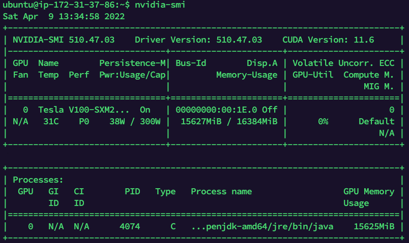

# Spark3 GPU XGboost Applications

## Launch & Setup EC2 Instance on AWS

Before you start the application you need to follow the steps in the repository linked below.

[https://github.com/ozgunakin/spark3-gpu-nvidia-rapidsai-setup-on-aws-ec2](https://github.com/ozgunakin/spark3-gpu-nvidia-rapidsai-setup-on-aws-ec2)

## Download the Dataset and the Application Files.

We will use mortgage, agaricus and taxi datasets for XGboost examples. All datasets and jupyter notebooks are placed in this repository.&#x20;

* [x] Clone this repository to /opt/xgboost directory.

```
cd /opt/xgboost

git clone https://github.com/ozgunakin/spark3-gpu-xgboost-applications.git

cd spark3-gpu-xgboost-applications/dataset

#EXTRACT and MOVE AGARICUS FILES
tar -xvf agaricus-small.tar
mv agaricus /opt/xgboost

#EXTRACT and MOVE MORTGATE FILES
tar -xvf mortgage-small-2.tar
mv mortgage /opt/xgboost

#EXTRACT and MOVE TAXI FILES
tar -xvf taxi-small.tar
mv taxi /opt/xgboost
```

## Run GPU Based XGBoost Applications

You can find notebooks for XGBoost applications designed by using three different datasets in the notebooks directory of the repository that we have downloaded in the previous section.

* [x] Install findspark library for Jupyter-Spark Integration.

```
pip3 install -q findspark
```

* [x] Open Jupyter Notebook in /opt/xgboost/ directory.

```
cd /opt/xgboost/spark3-gpu-xgboost-applications

nohup jupyter notebook --ip 0.0.0.0 &

```

* [x] Get the Jupyter Notebook Token

```
jupyter notebook list
```

 (1).png>)

* [x] Open Jupyter Notebook in Your Browser

.png>)

* [x] All notebooks are placed in the notebooks file. You can run them for testing your GPU integrated Spark with XGboost models.&#x20;
* [x] Those notebooks are customized versions of the notebooks in spark-rapids-exmaples repository of NVIDIA. You can find more examples at [https://github.com/NVIDIA/spark-rapids-examples](https://github.com/NVIDIA/spark-rapids-examples)

## Check GPU Usage

* [x] While running notebooks you can check GPU usage from your terminal using nvidia-smi command.&#x20;


